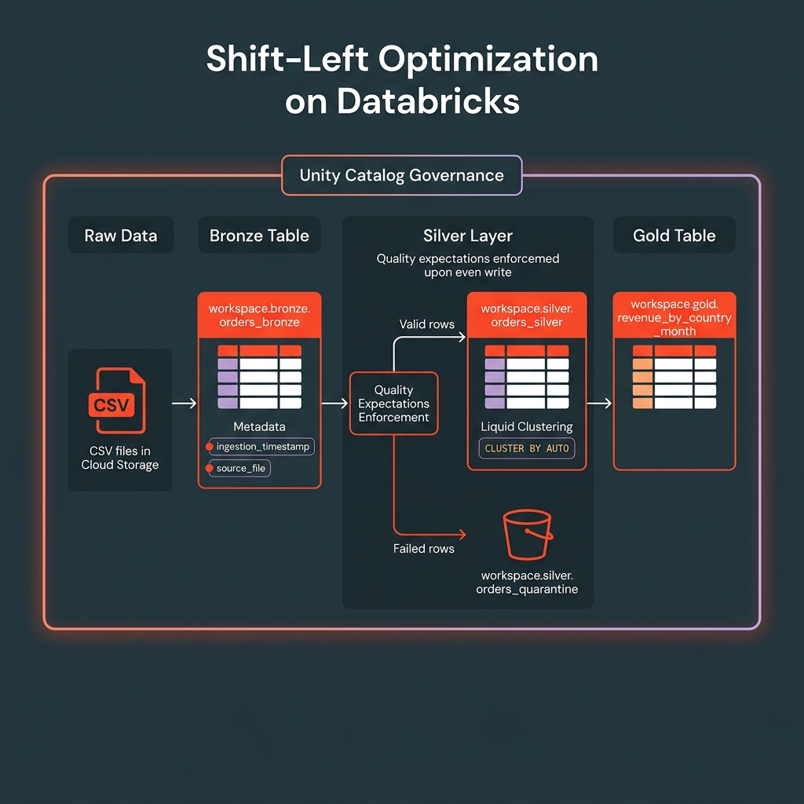

<p align="center">
  
</p>

<h1 align="center">Shift-Left Optimization — Liquid Clustering + DLT Quality Pre-Checks</h1>

<p align="center">
  <em>Optimize data on write, not in a separate job — a Medallion pipeline on Databricks, Unity Catalog, and Delta Lake</em>
</p>

<p align="center">
  
  
  
  
</p>

---

## Overview

A Medallion pipeline over the small **[E-Commerce Customer Behavior](https://www.kaggle.com/datasets/uom190346a/e-commerce-customer-behavior-dataset)**
dataset (~350 rows, the same dataset family as the sibling
[databricks-scd2-pipeline](../databricks-scd2-pipeline)) that demonstrates **shift-left
optimization** — enforcing quality and data layout *at the moment data is written*, instead of
running separate jobs to fix it later:

- **Quality pre-checks on input** — every row is tested against a rule set as it enters Silver.
  Passing rows flow through; failing rows are **quarantined** (not dropped) with the reasons they
  failed. This is the Delta Live Tables (DLT) *expectations* model.
- **Automatic Liquid Clustering on write** — every table uses `CLUSTER BY AUTO`, so Databricks
  picks and *evolves* clustering keys from query patterns. **No `OPTIMIZE`/`ZORDER` job, no keys to babysit.**

Fewer scheduled jobs, predictable performance, and a Gold layer trusted by construction — all on
**Databricks Free Edition**.

| Layer | Purpose | Table (`CLUSTER BY AUTO`) |
|:-----:|---------|---------------------------|
| **Bronze** | Raw ingestion + lineage (raw fidelity preserved) | `workspace.bronze.customers_bronze` |
| **Silver** | DLT-style quality expectations, on input | `workspace.silver.customers_silver` (+ `customers_quarantine`) |
| **Gold** | Customer value by segment | `workspace.gold.segment_value` |

---

## Dataset

**[E-Commerce Customer Behavior](https://www.kaggle.com/datasets/uom190346a/e-commerce-customer-behavior-dataset)**
— ~350 rows, one customer per row, with columns `Customer ID, Gender, Age, City, Membership Type,
Total Spend, Items Purchased, Average Rating, Discount Applied, Days Since Last Purchase,
Satisfaction Level`. Small enough to run instantly on Free Edition, and it ships with real
defects so the quality pre-checks catch genuine problems:

| Real / business-rule defect | Expectation that catches it |
|-----------------------------|-----------------------------|
| Missing `Satisfaction Level` values | `satisfaction_level IS NOT NULL` |
| Implausible `Age` | `age BETWEEN 18 AND 100` |
| Non-positive `Total Spend` / `Items Purchased` | `total_spend > 0`, `items_purchased > 0` |
| Out-of-range `Average Rating` | `avg_rating BETWEEN 1 AND 5` |
| Unknown membership tier | `membership_type IN ('Gold','Silver','Bronze')` |

> **Honest note on scale:** at ~350 rows everything lives in a single Delta file, so Liquid
> Clustering won't visibly *prune* files here — this project demonstrates the **pattern and
> zero-maintenance workflow** (`CLUSTER BY AUTO`, quality on input). The benefit shows at scale;
> swap in a larger source table and the same code optimizes layout without a single config change.

---

## Project Structure

```
databricks-shift-left-optimization/
├── schema_mgt/
│   └── 00_setup_and_data_prep.ipynb
├── src/
│   ├── 01_customers_bronze.ipynb
│   ├── 02_customers_silver.ipynb    ← the shift-left centerpiece
│   └── 03_customers_gold.ipynb
├── docs/architecture_diagram.png
├── .gitignore · LICENSE · README.md
```

Unity Catalog: catalog `workspace` (Free Edition default) → schemas `raw` / `bronze` / `silver` /
`gold`, all created on first run.

---

## Getting Started

1. Import the notebooks into Databricks (**Repos**, or upload the `.ipynb` files).
2. Download the CSV from [Kaggle](https://www.kaggle.com/datasets/uom190346a/e-commerce-customer-behavior-dataset)
   and upload it via **Catalog → Create → Table** so it registers as
   `workspace.default.ecommerce_customers` (update `SOURCE_TABLE` in notebook `00` if your name differs).
3. Run the notebooks in order:

| Step | Notebook | Description |
|:----:|----------|-------------|
| 0 | `schema_mgt/00_setup_and_data_prep` | Create schemas; read source table; normalise columns; land `raw.customers_raw` |
| 1 | `src/01_customers_bronze` | Raw → Bronze with `ingestion_timestamp` + `source_file` lineage |
| 2 | `src/02_customers_silver` | Quality expectations (pass / quarantine) + auto-clustered write |
| 3 | `src/03_customers_gold` | Customer value by membership tier & city + Delta Time Travel |

**Prerequisites:** a Unity Catalog workspace (Free Edition works); Databricks Runtime 13.3 LTS+ or Free Edition serverless.

---

## Architecture Deep Dive

### Why shift-left?

The traditional pipeline treats quality and layout as **afterthoughts** — separate jobs that run
*after* data lands, costing extra clusters, extra latency, and a window where Gold reads bad data:

```
ingest dirty data → [nightly OPTIMIZE + ZORDER] → [separate data-quality job] → reprocess
```

Shift-left moves both to the point of ingestion:

```
┌──────────┐     ┌─────────────────────────────────────┐     ┌──────────┐
│  BRONZE  │────>│  SILVER                              │────>│   GOLD   │
│ raw +    │     │  • expectations enforced ON INPUT    │     │ trusted  │
│ lineage  │     │  • CLUSTER BY AUTO layout ON WRITE   │     │ + fast   │
└──────────┘     │  → no separate OPTIMIZE / DQ job     │     └──────────┘
                 └──────────────────┬──────────────────┘
                                    │ failures
                                    ▼
                            ┌──────────────┐
                            │  QUARANTINE  │
                            └──────────────┘
```

### Liquid Clustering vs. the old way

| | Partitioning | ZORDER (OPTIMIZE) | **Liquid Clustering (`CLUSTER BY AUTO`)** |
|---|---|---|---|
| When layout happens | On write (rigid dirs) | **Separate job, after the fact** | **On write, incrementally** |
| Separate optimize job? | No (but small-file problem) | **Yes — scheduled `OPTIMIZE`** | **No** |
| Key selection | You partition | You pick ZORDER cols | **Databricks picks + evolves them** |
| High cardinality / skew | Suffers | OK | Handled |

This project uses **`CLUSTER BY AUTO` on every table** — declared in the Silver DDL and enabled
via `ALTER TABLE ... CLUSTER BY AUTO` on raw/bronze/gold. Databricks selects and evolves keys from
real query patterns (predictive optimization), so there are no keys to choose or maintain and no
recurring `OPTIMIZE` job. File-level min/max stats give **data skipping** on filtered queries (at scale).

### DLT Expectations (quality pre-checks)

| Action | Decorator | Effect on a failing row |
|--------|-----------|-------------------------|
| Warn | `@dlt.expect` / `expect_all` | Keep the row, record the violation |
| Drop | `@dlt.expect_or_drop` / `expect_all_or_drop` | Remove the row |
| Fail | `@dlt.expect_or_fail` / `expect_all_or_fail` | Stop the pipeline (hard gate) |

Silver uses the **quarantine pattern** — failures are routed to a side table with a `failed_rules`
array (a NULL rule result counts as a failure, so every quarantined row is explainable). Expectations
are stored **as data** (rule name → SQL), the same rule set fed to `@dlt.expect_all_or_drop` in the
included declarative DLT form; pass/fail counts surface in the **DLT event log**.

| Principle | Implementation |
|-----------|---------------|
| Raw fidelity | Bronze stores source as-received (dirty rows preserved) |
| Quality on input | Silver expectations split valid vs. quarantine at ingestion |
| Layout on write | `CLUSTER BY AUTO` everywhere — no `OPTIMIZE`/`ZORDER` job |
| Lineage | `ingestion_timestamp` + `source_file` at Bronze |
| Auditability | Delta Time Travel (`DESCRIBE HISTORY`, `versionAsOf`) at Gold |
| Governance | Unity Catalog manages all tables |

---

## Sample Output

Quarantine breakdown from `02_customers_silver` — every rejected row, explained:

```sql
SELECT failed_rules, COUNT(*) AS rows_quarantined
FROM workspace.silver.customers_quarantine
GROUP BY failed_rules ORDER BY rows_quarantined DESC
```

| failed_rules | rows_quarantined |
|--------------|:----------------:|
| `["has_satisfaction"]` | (the rows with missing Satisfaction Level) |
| `["valid_rating"]` | (any out-of-range ratings) |

---

## Extending the Pipeline
- Point `SOURCE_TABLE` at a **larger** table to see Liquid Clustering's data-skipping benefit.
- Run notebook `02` as a real **Lakeflow / DLT pipeline** (the declarative form is included) and chart the event-log expectation metrics.
- Orchestrate the notebooks as a **Databricks Job** with task dependencies.
- Package and deploy with **Databricks Asset Bundles (DABs)** for CI/CD.

---

## License
MIT — see [LICENSE](LICENSE).

## Acknowledgments
- **Dataset:** [E-Commerce Customer Behavior on Kaggle](https://www.kaggle.com/datasets/uom190346a/e-commerce-customer-behavior-dataset)
- **Concepts:** [Liquid Clustering](https://docs.databricks.com/aws/en/delta/clustering) · [DLT expectations](https://docs.databricks.com/aws/en/dlt/expectations) · [Medallion Architecture](https://www.databricks.com/glossary/medallion-architecture)
